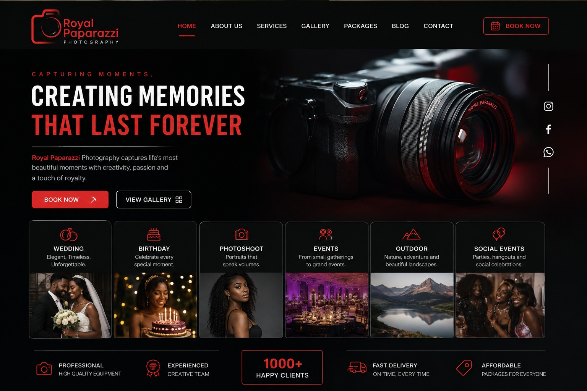
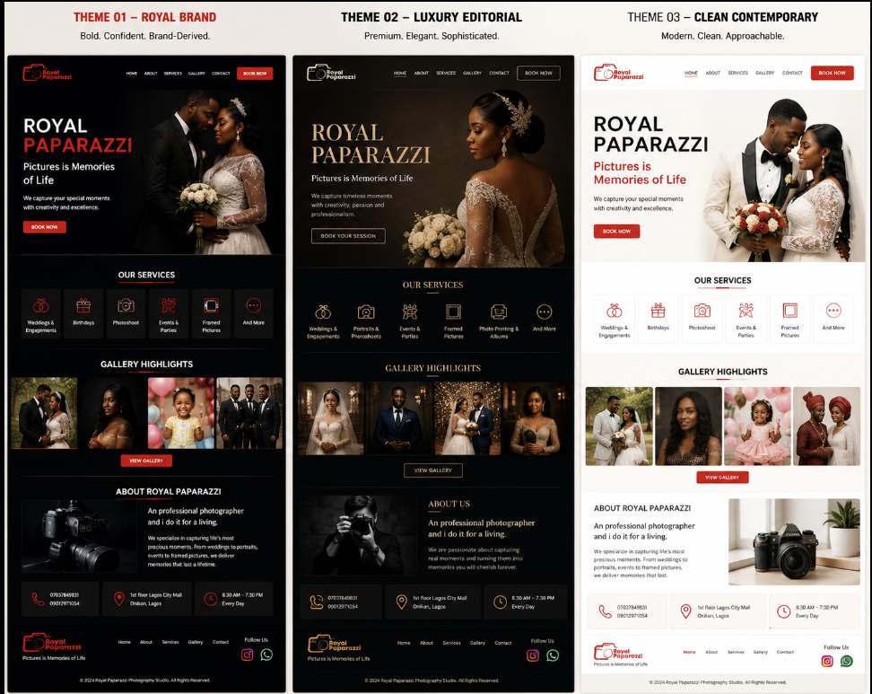

# Design

## Design Goals

The website should present Royal Paparazzi as a professional photography
studio while keeping photography and visual content as the primary focus.

The design should:

- Establish a strong and recognizable visual identity.
- Make the photography work the main visual focus.
- Feel professional and trustworthy.
- Make the business and its services easy to understand.
- Make contacting the business easy.
- Work well across mobile, tablet, and desktop.
- Support multiple visual directions without requiring the website structure
  to be rebuilt.

---

## Design Direction

The website will be developed around a shared design system that can support
multiple visual themes.

The themes will use the same core website structure and content while allowing
their visual presentation to differ.

### Theme 01 — Royal Brand

**Direction:** Brand-derived, bold, dark, and photography-led.

This direction is based on Royal Paparazzi's existing visual identity,
particularly the dark background, red camera/logo treatment, and light
typography visible in the business's promotional material.

The website should feel like a professional digital evolution of the
business's existing branding rather than a replacement for it.

**Personality:**

- Bold
- Confident
- Dramatic
- Professional
- Recognizable

**Visual approach:**

- Very dark background
- Red as the primary accent
- White/light text
- Large, high-impact photography
- Strong typographic hierarchy
- High contrast
- Thin, subtle borders
- Red line-style icons
- Structured rectangular cards
- Restrained decorative elements

Photography and typography should provide most of the visual impact.

Red should be used selectively for:

- Primary calls to action
- Important headings or text emphasis
- Icons
- Active navigation states
- Small decorative details
- Important interface states

Large areas of solid red should generally be avoided unless deliberately
used as part of a visual composition.

---

---

### Theme 02 — Luxury Editorial

**Direction:** Premium, elegant, and photography-focused.

This direction explores a more sophisticated presentation of the business while
maintaining the same underlying content and website structure.

**Personality:**

- Elegant
- Premium
- Sophisticated
- Minimal
- Artistic

**Visual approach:**

- Deep neutral backgrounds
- Warm, restrained accent colors
- Large photography
- Strong typographic hierarchy
- Generous whitespace
- Thin borders
- Minimal decorative elements

Photography should remain the dominant visual element, with typography and
spacing providing the sense of luxury.

---

### Theme 03 — Clean Contemporary

**Direction:** Modern, clean, and approachable.

This direction provides a lighter alternative to the darker concepts while
retaining a connection to the Royal Paparazzi identity.

**Personality:**

- Modern
- Clean
- Professional
- Approachable
- Simple

**Visual approach:**

- Light or off-white background
- Dark text
- Royal Paparazzi red used as an accent
- Clean grid-based layouts
- Generous whitespace
- Clear calls to action
- Photography used as the primary visual element
- Subtle borders and surfaces

The design should feel modern without becoming overly minimal or generic.

---

## Shared Design Principles

Regardless of the selected theme, the website should follow these principles:

### Photography First

Photography should remain one of the strongest visual elements throughout
the website.

### Clear Hierarchy

Important information such as the business name, services, photography, and
contact actions should be visually easy to identify.

### Simplicity

Visual elements should support the content rather than compete with it.

### Consistency

Colors, typography, spacing, buttons, cards, and other interface elements
should follow a consistent system throughout the website.

### Responsive by Design

The design should be planned for different screen sizes rather than treating
mobile as an afterthought.

### Theme Flexibility

Themes should primarily change the visual presentation of the website while
preserving the underlying structure and content.

Major structural differences should only be introduced when they provide a
clear design benefit.

### Sample image

---
---

## Color System

The website will use semantic color roles rather than assigning colors
directly to individual components.

This allows the same interface to support multiple visual themes while
maintaining consistent relationships between colors.

### Color Roles

The core color roles are:

| Role | Purpose |
| --- | --- |
| Background | Main page background |
| Surface | Cards, panels, and elevated sections |
| Primary | Main brand/action color |
| Secondary | Supporting accent color |
| Text | Primary readable text |
| Text Muted | Secondary/supporting text |
| Border | Dividers, outlines, and subtle boundaries |
| On Primary | Text/icons placed on the primary color |

Theme-specific values will be defined in the website's theme system rather
than directly throughout the HTML.

---

## Theme 01 — Royal Brand

The Royal Brand palette is derived from the existing Royal Paparazzi visual
identity observed in its promotional material.

The existing branding prominently uses a dark background, red logo/accent,
and light text.

### Preliminary Palette

| Role | Color | Purpose |
|---|---|---|
| Background | `#0B0C0E` | Main page background |
| Surface | `#141519` | Cards and secondary sections |
| Primary | `#D92F36` | Main brand/action color |
| Secondary | `#9F2026` | Deeper red accent |
| Text | `#F5F5F5` | Primary text |
| Text Muted | `#A7A7AA` | Supporting text |
| Border | `#303136` | Subtle borders/dividers |
| On Primary | `#FFFFFF` | Text on red elements |

### Design Intent

The palette should preserve the recognizable relationship between the
business's existing red branding and dark background while presenting it in a
more polished and consistent way.

Red should be used deliberately for:

- Primary calls to action
- Important highlights
- Selected navigation states
- Small decorative accents
- Important interactive elements

Red should not be used as the dominant color of every section.

### Color Character

The palette should closely reflect the existing Royal Paparazzi branding
while improving consistency and contrast for digital use.

The dominant relationship is:

**Dark background + light typography + restrained red accent**

The red should remain recognizable as the brand's defining accent without
being used excessively.

---

## Theme 02 — Luxury Editorial

The Luxury Editorial palette should create a more sophisticated and premium
presentation while keeping the photography as the primary visual focus.

### Preliminary Palette

| Role | Color | Purpose |
| --- | --- | --- |
| Background | `#11100E` | Main page background |
| Surface | `#1C1915` | Secondary sections |
| Primary | `#C9A46A` | Premium accent/action color |
| Secondary | `#8C7048` | Supporting accent |
| Text | `#F4EFE6` | Primary text |
| Text Muted | `#AFA79B` | Supporting text |
| Border | `#39332A` | Subtle borders/dividers |
| On Primary | `#11100E` | Text on gold elements |

### Design Intent

The palette should feel understated rather than decorative.

The accent color should be used sparingly for:

- Calls to action
- Section accents
- Important labels
- Fine borders
- Selected states

Photography should provide most of the visual richness.

---

## Theme 03 — Clean Contemporary

The Clean Contemporary palette provides a lighter and more approachable
alternative.

It retains a connection to the Royal Paparazzi identity through restrained
use of the brand red.

### Preliminary Palette

| Role | Color | Purpose |
| --- | --- | --- |
| Background | `#F7F6F3` | Main page background |
| Surface | `#FFFFFF` | Cards and elevated sections |
| Primary | `#C92F3A` | Main brand/action color |
| Secondary | `#7D252B` | Supporting accent |
| Text | `#171719` | Primary text |
| Text Muted | `#68686D` | Supporting text |
| Border | `#E2E1DE` | Subtle borders/dividers |
| On Primary | `#FFFFFF` | Text on red elements |

### Design Intent

The design should feel clean and modern without becoming disconnected from
the Royal Paparazzi identity.

The red accent should remain recognizable but controlled.

---

## Color Usage Rules

Regardless of the selected theme:

- The background should provide the dominant visual foundation.
- Primary colors should be reserved for important actions and brand
  emphasis.
- Secondary colors should support the primary color rather than compete with
  it.
- Muted text should be used for supporting information, not essential
  content.
- Borders should remain subtle.
- Large areas of strong accent colors should be avoided unless deliberately
  used as part of a section or visual composition.
- Photography should remain one of the strongest sources of visual emphasis.
- Text must remain sufficiently distinguishable from its background.

## Theme Implementation

The website will use CSS custom properties to store theme values.

Theme values will be mapped to semantic color roles such as:

- `background`
- `surface`
- `primary`
- `secondary`
- `text`
- `text-muted`
- `border`
- `on-primary`

Tailwind CSS will use these semantic roles when styling website components.

The exact implementation of the theme system will be defined during
development.

## Important thing to note

These hex values are preliminary, not final.

I don't want us to pretend that #C92F3A is somehow the objectively correct Royal Paparazzi red. We're using the existing sign as a reference and establishing a starting point.

Before implementation, we'll refine things like:

Is the red too bright?
Is the dark background actually navy, charcoal, or almost black?
Does the red work against the photography?
Does the gold in Theme 02 feel appropriate?
Is Theme 03 sufficiently connected to the brand?

And we'll eventually test the colors on actual sections of the website, not just in a table.

---
---

## Typography

Typography should provide clear hierarchy while allowing photography to
remain the primary visual focus.

The typography system will define semantic roles rather than styling text
individually throughout the website.

---

## Typography Roles

The main typography roles are:

| Role | Purpose |
|---|---|
| Display | Large hero and prominent visual headings |
| Heading | Page and section headings |
| Subheading | Supporting headings and introductory text |
| Body | Main readable content |
| Small | Supporting information and secondary text |
| Label | Buttons, navigation, categories, and short UI labels |

---

## Font Families

The website will use a primary body font and may use a separate display
font for headings where appropriate.

### Body Font

**Family:** [TO SELECT]

The body font should:

- Be highly readable.
- Work well across different screen sizes.
- Have a clean and professional appearance.
- Support the required characters and punctuation.

### Display / Heading Font

**Family:** [TO SELECT]

The display font may differ from the body font when required by the selected
visual theme.

It should:

- Create a clear visual identity.
- Remain readable at large sizes.
- Complement the photography.
- Avoid becoming overly decorative.

---

## Type Scale

The website will use a consistent type scale.

### Preliminary Scale

| Role | Size | Usage |
|---|---:|---|
| Display | `clamp(2.5rem, 6vw, 5rem)` | Hero/display headings |
| H1 | `clamp(2rem, 4vw, 3.5rem)` | Main page headings |
| H2 | `clamp(1.75rem, 3vw, 2.5rem)` | Major section headings |
| H3 | `clamp(1.25rem, 2vw, 1.75rem)` | Component/subsection headings |
| Body | `1rem` | Main paragraph text |
| Small | `0.875rem` | Supporting information |
| Label | `0.875rem` | Buttons and UI labels |

These values are preliminary and may be adjusted during implementation and
visual testing.

---

## Font Weights

The typography system will primarily use:

- Regular — `400`
- Medium — `500`
- Semibold — `600`
- Bold — `700`

Not every weight needs to be used in every theme.

Font weight should be used to establish hierarchy rather than decoration.

---

## Line Height

### Headings

Headings should generally use tighter line heights to maintain a strong
visual hierarchy.

**Target range:** `1.1 – 1.25`

### Body

Body text should use a more comfortable reading line height.

**Target range:** `1.5 – 1.7`

---

## Theme Typography

Typography may vary between themes when it contributes meaningfully to the
visual direction.

### Royal Brand

Typography should feel:

- Bold
- Direct
- Confident
- Modern

The typography should support the existing bold visual identity without
becoming overly decorative.

### Luxury Editorial

Typography should feel:

- Elegant
- Refined
- Sophisticated
- Editorial

A contrasting display and body font combination may be used if it improves
the premium photography-focused presentation.

### Clean Contemporary

Typography should feel:

- Clean
- Modern
- Simple
- Approachable

A primarily sans-serif system may be used to maintain the straightforward
character of this direction.

---

## Typography Rules

- Maintain a clear distinction between headings and body text.
- Avoid using too many font families.
- Avoid excessive use of bold text.
- Maintain readable line lengths for paragraphs.
- Use typography to establish hierarchy rather than relying entirely on
  color or size.
- Typography should remain readable across all supported screen sizes.
- Decorative typography should never reduce readability.

---
I haven't picked specific fonts yet.

We need to choose them based on the three directions, and we should actually look at combinations rather than arbitrarily saying "use Poppins" or "use Playfair Display."

For example, we might eventually end up with something like:

ROYAL BRAND
Heading:     Sans-serif
Body:        Sans-serif

LUXURY
Heading:     Serif
Body:        Sans-serif

CLEAN
Heading:     Sans-serif
Body:        Sans-serif

But that's a design decision we'll make, not something we should assume.

Also, the clamp() values above are a good example of something we'll learn as we implement it. You don't need to know clamp() yet either, we'll get to it when we're actually writing the CSS/Tailwind.

---

## Spacing

The website will use a consistent spacing scale to maintain visual rhythm
between sections, components, and individual elements.

Spacing should generally increase with the level of separation between
elements:

- Small spacing for closely related elements.
- Medium spacing for groups of related content.
- Large spacing between major sections.
- Extra-large spacing for major visual breaks and hero areas.

---

## Spacing Scale

The initial spacing scale is:

| Token | Value | Typical Usage |
|---|---:|---|
| `xs` | `0.25rem` (4px) | Very small gaps, icon/text spacing |
| `sm` | `0.5rem` (8px) | Small gaps between related elements |
| `md` | `1rem` (16px) | Standard component spacing |
| `lg` | `1.5rem` (24px) | Larger component spacing |
| `xl` | `2rem` (32px) | Component groups |
| `2xl` | `3rem` (48px) | Section internal spacing |
| `3xl` | `4rem` (64px) | Major section spacing |
| `4xl` | `6rem` (96px) | Large visual separation |

These values are a starting system and may be adjusted during implementation
if visual testing shows that a different scale produces a more consistent
result.

---

## Section Spacing

Major website sections should generally use generous vertical spacing to
avoid making the page feel crowded.

The exact spacing may vary depending on the section and screen size.

### Desktop

Target range:

- `64px – 96px` between major sections.

### Tablet

Target range:

- `48px – 72px` between major sections.

### Mobile

Target range:

- `40px – 64px` between major sections.

Hero sections may use larger spacing where appropriate.

---

## Component Spacing

Spacing within components should generally follow the spacing scale.

Examples:

- Icon → text: `xs` to `sm`
- Heading → supporting text: `sm` to `md`
- Text → button: `md`
- Card content groups: `md` to `lg`
- Card → card: `md` to `lg`

These are guidelines rather than rigid rules.

---

## Container Spacing

The website should maintain consistent horizontal spacing between the
content and the edges of the viewport.

Smaller screens should use smaller horizontal padding, while larger screens
should provide more breathing room.

The final container width and horizontal padding values will be established
during layout implementation.

---

## Spacing Principles

- Use the spacing scale consistently.
- Avoid introducing arbitrary spacing values without a clear reason.
- Related content should remain visually grouped.
- Major sections should have enough space to establish separation.
- Spacing should support hierarchy rather than simply making the page
  larger.
- Mobile layouts should use reduced spacing where necessary to avoid
  excessive scrolling.
- Theme variations may adjust spacing when required by their visual
  direction, but the underlying spacing system should remain consistent.

**Tailwind already has its own spacing scale.**

So we don't necessarily need to create CSS variables for every spacing value. That's an important distinction from our colors.

For example, Tailwind can already give us things like:

gap-4
p-6
mt-8

The design document tells us which spacing scale we're aiming for; Tailwind handles the implementation.

That's another reason not to blindly turn everything into CSS variables.

## UI Patterns

The website will use a consistent set of UI patterns across its pages.

These patterns should maintain the selected theme's visual identity while
remaining consistent in structure and behavior.

---

## Navigation

The primary navigation should provide access to:

- Home
- About
- Services
- Gallery
- Contact

The navigation should:

- Clearly identify the Royal Paparazzi brand.
- Provide an obvious active/current page state.
- Remain easy to use on smaller screens.
- Provide a clear path toward contacting the business.

### Royal Brand Direction

The navigation should use a dark, minimal treatment with light text and
restrained red accents.

The logo/brand should remain visually prominent without competing with the
main page content.

---

## Buttons

Buttons should provide clear visual hierarchy between primary and secondary
actions.

### Primary Button

Used for the most important action in a section.

Typical examples:

- Contact Us
- Book a Session
- View Our Work

The primary button should use the theme's primary color where appropriate.

### Secondary Button

Used for supporting actions.

Examples:

- View Gallery
- Learn More
- View Services

Secondary buttons may use:

- Outline treatment
- Transparent treatment
- Subtle surface treatment

The exact appearance should follow the selected theme.

### Button Principles

- Button text should clearly communicate the action.
- Buttons should have sufficient clickable area.
- Primary and secondary actions should be visually distinguishable.
- Hover and focus states should be clearly visible.
- Button styling should remain consistent throughout the website.

---

## Section Headings

Section headings should establish clear hierarchy and help visitors scan the
page.

A typical section heading may contain:

- Small label or category
- Main heading
- Optional supporting description

The heading system should remain visually consistent while allowing different
themes to adjust typography and decorative treatment.

---

## Service Cards

Service cards may be used to present major service categories.

A service card can contain:

- Icon or visual identifier
- Service name
- Short description
- Optional image
- Optional link/action

Cards should remain concise and should not attempt to display the entire
service description or every available service detail.

### Royal Brand Direction

Service cards should use:

- Dark surfaces
- Subtle borders
- Red line-style icons or accents
- Light typography
- Strong spacing

Cards should remain relatively simple so that the photography and service
names remain the focus.

---

## Gallery Items

Gallery items should prioritize the photography itself.

Gallery items should generally:

- Use consistent image treatment.
- Preserve the important parts of the image.
- Support different image aspect ratios where appropriate.
- Avoid unnecessary text overlays.
- Provide a clear interaction when an image can be opened or enlarged.

---

## Contact Information

Contact information should be presented clearly and should prioritize the
methods that are actually available and verified.

Potential contact items include:

- Phone
- WhatsApp
- Email
- Location
- Social media

Icons may be used to improve scanning, but they should not replace visible
text where the information is important.

---

## Cards and Surfaces

Cards and surfaces should be used selectively.

They should help group related information rather than being applied to every
section of the website.

Theme variations may change:

- Background color
- Border treatment
- Radius
- Shadow
- Contrast

The underlying purpose of the surface should remain the same.

---

## Links

Text links should have a clear visual relationship with the selected theme.

Interactive links should provide an obvious hover and focus state.

Navigation links should clearly distinguish their active state from inactive
links.

---

## Icons

Icons should support comprehension rather than function primarily as
decoration.

The icon style should remain consistent throughout the website.

For the Royal Brand direction, a simple line-based icon style with the brand
red used as an accent is preferred.

---

## UI Consistency

The following should remain consistent throughout the website:

- Button treatment
- Border treatment
- Icon style
- Heading hierarchy
- Card structure
- Interactive states
- Spacing relationships
- Theme colors
- Typography roles

Individual sections may use different layouts where required by their content,
but they should still feel like parts of the same website.

Absolutely. We’ll continue with **`design.md` → Image Treatment**, keeping it within the responsibility defined by `document-definition.md`.

The goal here is to decide **how photography should look and behave**, not which exact images we use. Actual image selection belongs in `content.md`.

---

# Image Treatment

## Purpose

Define how photography and other visual assets should be presented throughout the website.

Photography is a primary part of Royal Paparazzi's visual identity, so images should be treated as a major design element rather than simple supporting content.

## Image Direction

The website should use photography prominently, with large, high-quality images used to establish the visual identity of the business.

Images should generally feel:

- Professional
- Authentic
- Visually engaging
- Cleanly presented
- Photography-focused
- Consistent across the website

The design should allow the quality of the photography to remain the primary visual focus rather than competing with excessive decorative elements.

---

## Image Usage

### Hero Images

Hero sections should use a strong, visually compelling photograph that immediately communicates the nature of the business.

Guidelines:

- Use large-format photography where possible.
- Prefer images with clear subjects.
- Avoid overly busy images behind important text.
- Use an overlay when necessary to maintain text readability.
- Preserve the important subject of the photograph when cropping.

For the --Royal Brand-- direction, hero photography should work particularly well with the dark visual system and strong red accents.

---

### Gallery Images

Gallery images should be presented as the primary content of the Gallery page.

The gallery should:

- Give images sufficient visual space.
- Maintain consistent spacing between images.
- Support different image aspect ratios where appropriate.
- Avoid unnecessary text over images.
- Preserve important portions of photographs when cropping.
- Allow visitors to focus on the photography itself.

A grid, masonry-style layout, or mixed-size layout may be used depending on the available photography.

The final layout should be determined after the available images have been reviewed.

---

### Service Images

Service sections may use supporting photography where it improves understanding or visual presentation.

Images should:

- Relate directly to the service.
- Support the service rather than dominate the content.
- Maintain a consistent visual treatment.
- Avoid unnecessary decorative imagery.

Not every service requires a separate image.

---

### About Images

The About section/page may use photography to provide personality and visual context.

Suitable imagery may include:

- Studio photography
- Photographer/team photography
- Behind-the-scenes photography
- Business/studio environment
- Relevant examples of the business's work

Actual availability of these images must be confirmed before being treated as a requirement.

---

## Aspect Ratios & Cropping

Images should use intentional aspect ratios rather than arbitrary cropping.

The chosen aspect ratio should depend on the context:

- **Hero:** Wide or full-height compositions where appropriate
- **Gallery:** Mixed aspect ratios may be used
- **Cards:** Consistent aspect ratios for visual alignment
- **Portraits:** Vertical ratios should be preserved where possible
- **Landscape/event photography:** Avoid aggressive cropping

Important subjects should not be cropped out simply to force an image into a predefined shape.

---

## Image Overlays

Overlays may be used when necessary for:

- Text readability
- Visual separation
- Hover interactions
- Creating stronger contrast

Overlays should remain subtle and should not significantly obscure the underlying photography.

For dark-themed designs, darker overlays may be used behind text-heavy hero sections.

---

## Image Borders, Radius & Effects

Image styling should remain restrained.

Possible treatments include:

- Subtle border radius
- Minimal borders
- Gentle shadows where appropriate
- Slight hover scaling for interactive gallery images

Avoid excessive:

- Drop shadows
- Decorative frames
- Filters
- Gradients over every image
- Artificial effects

The photography should remain the main visual element.

---

## Image Quality

Images used on the website should:

- Be sufficiently high resolution for their intended display size.
- Be optimized for web performance.
- Avoid unnecessary file size.
- Use appropriate image formats.
- Include meaningful `alt` text where the image conveys information.

Image optimization will be handled during implementation.

---

## Theme Considerations

Image treatment should adapt to the selected visual direction while maintaining the same overall photography-first approach.

### Royal Brand

- Large, high-contrast photography
- Dark surrounding surfaces
- Minimal red accents
- Strong image presence
- Subtle overlays where needed

### Luxury Editorial

- Large editorial-style photography
- Generous whitespace
- Elegant cropping
- Minimal overlays
- Photography used as a major compositional element

### Clean Contemporary

- Bright, clean presentation
- Consistent image ratios
- Minimal visual effects
- Clear separation between photography and surrounding content

---

## Consistency Rules

Across the website:

- Photography should feel intentional rather than decorative.
- Similar image types should receive similar treatment.
- Important subjects should remain visible.
- Image spacing should follow the project's spacing system.
- Image treatments should remain consistent with the selected theme.
- Visual effects should not overpower the photography.

---

# Responsive Design

## Purpose

Define how the website's layout, typography, spacing, navigation, imagery, and UI elements adapt across different screen sizes.

The website should provide a consistent and usable experience across:

- Mobile
- Tablet
- Desktop

The design should adapt to the available space rather than simply shrinking the desktop layout.

---

## Responsive Approach

The website will use a responsive, mobile-first approach.

Layouts should be designed around content and usability rather than individual device models.

The main priorities are:

1. Readability
2. Navigation usability
3. Clear visual hierarchy
4. Appropriate image presentation
5. Comfortable spacing
6. Touch-friendly interactions

---

## Breakpoint Behavior

The design will generally transition through three layout ranges:

| Screen | General Behavior |
|---|---|
| Mobile | Single-column, compact navigation, simplified layouts |
| Tablet | Increased spacing, multi-column layouts where appropriate |
| Desktop | Full navigation, larger compositions, wider grids and layouts |

Exact breakpoint values will be determined during implementation based on the content and layout rather than forcing every section to change at the same breakpoint.

---

## Navigation

### Mobile

The navigation should:

- Remain easy to access.
- Use a compact navigation pattern.
- Provide access to all primary pages.
- Keep the main contact CTA accessible where appropriate.
- Avoid occupying excessive screen space.

A menu button may be used to reveal the navigation links.

### Tablet

The navigation may transition toward the desktop structure if sufficient horizontal space is available.

### Desktop

The primary navigation should be visible without requiring an additional menu interaction.

Navigation should maintain clear spacing between:

- Logo/brand
- Navigation links
- Contact CTA

---

## Layout

### Mobile

Content should generally use a single-column layout.

Sections should:

- Have comfortable horizontal padding.
- Avoid excessive width.
- Stack elements vertically when necessary.
- Maintain clear separation between content groups.

### Tablet

Two-column layouts may be introduced where the content benefits from them.

Examples:

- Text + image
- Two service cards per row
- Two-column gallery layouts

### Desktop

The layout can make greater use of:

- Multi-column grids
- Larger image compositions
- Side-by-side content
- Asymmetrical layouts where appropriate
- Increased whitespace

Desktop layouts should not become excessively wide or difficult to scan.

---

## Typography

Typography should scale appropriately across screen sizes.

Large display text may reduce in size on smaller screens while maintaining its visual hierarchy.

The responsive hierarchy should preserve the relationship between:

**Display → H1 → H2 → H3 → Body → Small**

Headings should not become so large on mobile that they dominate the available screen space.

Body text should remain comfortable to read without requiring horizontal scrolling.

---

## Spacing

Spacing should decrease progressively on smaller screens while remaining visually comfortable.

### Desktop

Use the larger spacing values defined in the spacing system for major sections.

### Tablet

Reduce section spacing where necessary to maintain proportion.

### Mobile

Use smaller spacing values while preserving enough separation between sections and content groups.

The goal is not simply to make everything smaller, but to maintain the same visual hierarchy within a smaller space.

---

## Hero Section

The hero should adapt significantly between desktop and mobile.

### Desktop

The hero may use:

- Large photography
- Large display typography
- Side-by-side or layered compositions
- Multiple visual elements

### Mobile

The hero should prioritize:

1. Main message
2. Supporting text
3. Primary CTA
4. Strong photography

Complex desktop compositions should be simplified where necessary.

Text should remain readable against the image.

---

## Services

Service layouts should adapt according to available width.

### Desktop

Services may be displayed in multiple columns.

### Tablet

The number of columns may be reduced.

### Mobile

Services should generally stack into a single-column layout or another easily scannable arrangement.

Cards should not become so narrow that their content is difficult to read.

---

## Gallery

The gallery should remain photography-focused at every screen size.

### Desktop

The gallery may use:

- Multiple columns
- Mixed image sizes
- Masonry-style layouts
- Featured images

### Tablet

The number of columns should be reduced where necessary.

### Mobile

Images should receive sufficient width and spacing to remain visually engaging.

The gallery should avoid excessively small thumbnails.

Image cropping should continue to preserve important subjects across breakpoints.

---

## About Section

Desktop layouts may place text and imagery beside each other.

On smaller screens, these elements should generally stack vertically.

The order should prioritize the most important information first.

---

## Contact Section

Contact information should remain immediately accessible across all screen sizes.

On mobile:

- Contact options should be easy to tap.
- Phone and WhatsApp actions should have sufficient touch area.
- Location information should remain readable.
- Contact forms, if used, should not require unnecessary horizontal space.

---

## Buttons & Interactive Elements

Interactive elements should remain usable on touch devices.

Buttons should:

- Have sufficient touch area.
- Maintain readable text.
- Have adequate spacing between adjacent actions.
- Avoid requiring precise cursor interaction.

Hover effects should not be necessary to understand or use the interface.

Focus states should remain visible for keyboard users.

---

## Images

Images should remain responsive without distortion.

Across breakpoints:

- Preserve important subjects.
- Adjust cropping where necessary.
- Maintain appropriate aspect ratios.
- Avoid unnecessarily large image downloads where possible.
- Ensure images do not cause horizontal overflow.

The image treatment defined in the previous section remains the visual standard across breakpoints.

---

## Theme Consistency

Responsive changes should not alter the fundamental visual identity of the selected theme.

For example, the **Royal Brand** direction should remain recognizably dark, high-contrast, photography-led, and red-accented on both mobile and desktop.

Responsive design changes:

**layout → not identity**

**spacing → not hierarchy**

**composition → not brand**

---

## Responsive Testing

The finished website should be tested at representative:

- Mobile widths
- Tablet widths
- Desktop widths

Testing should verify:

- No horizontal overflow
- Navigation works correctly
- Text remains readable
- Images display correctly
- Buttons remain usable
- Layout transitions are intentional
- No content becomes inaccessible
- Sections maintain their visual hierarchy
